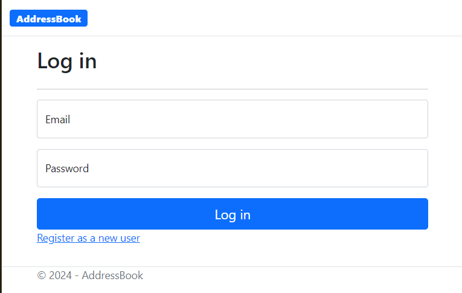
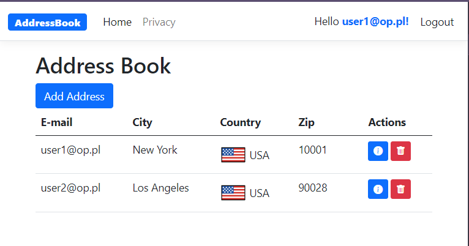
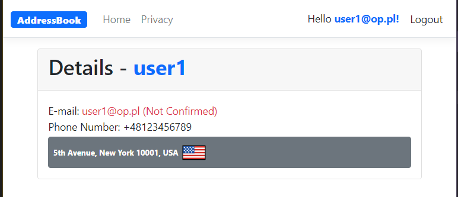
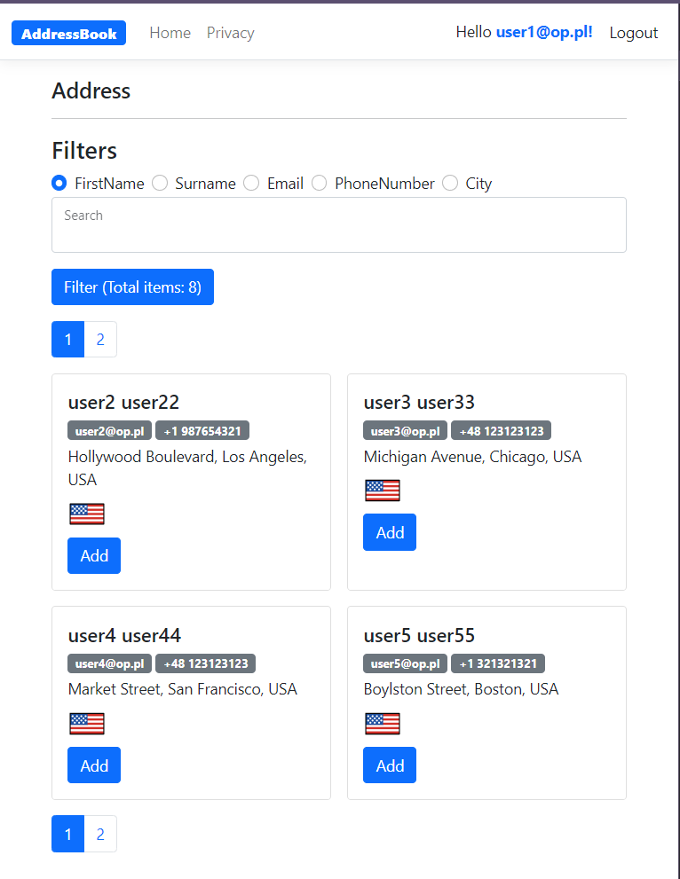
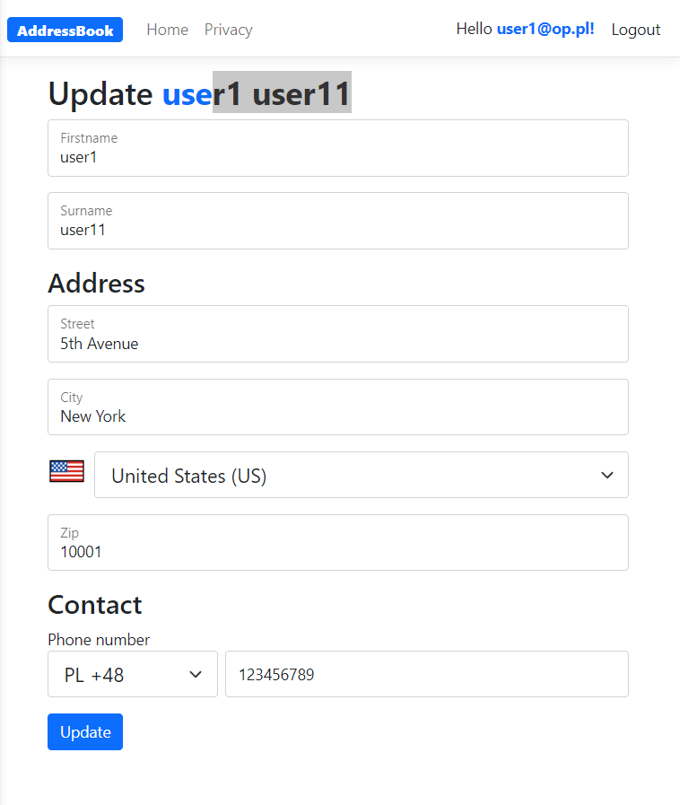
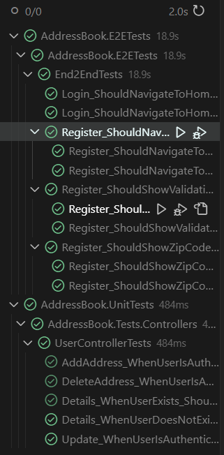

# Address Book

With this app you will be able to register user, add other users to your address book or delete them. You can also edit your user data. To use you need to be login. App is using in memory database with preseeded data.

# Tech:
- .Net 8
- ASP MVC
- Entity Framework
- XUnit
- Selenium (E2E)
- Fluent Validation
- Automapper
- Microsoft Identity

# Run
To run app you need install all dependencies and run command `dotnet run` or use Docker. 

# Overview

## Register page
All inputs are required. Country, Country code and phone code data are from [Json file](./AddressBook/wwwroot/Json/CountryData.json), also Postal code need to be in valid format based on selected country standards.

## Login page
Use E-mail to login

## Home Page
You can click add address to search for addresses. In table you can see basic information about already added addresses. You can see datails or delete them.

## Details page

## Add Address page

You can filter by FistName, Surname, Email, PhoneNumber, City. There is also a pagination(4 items per page)

## Update page 

Clicking on user email it redirect you to update user page.

## Tests

